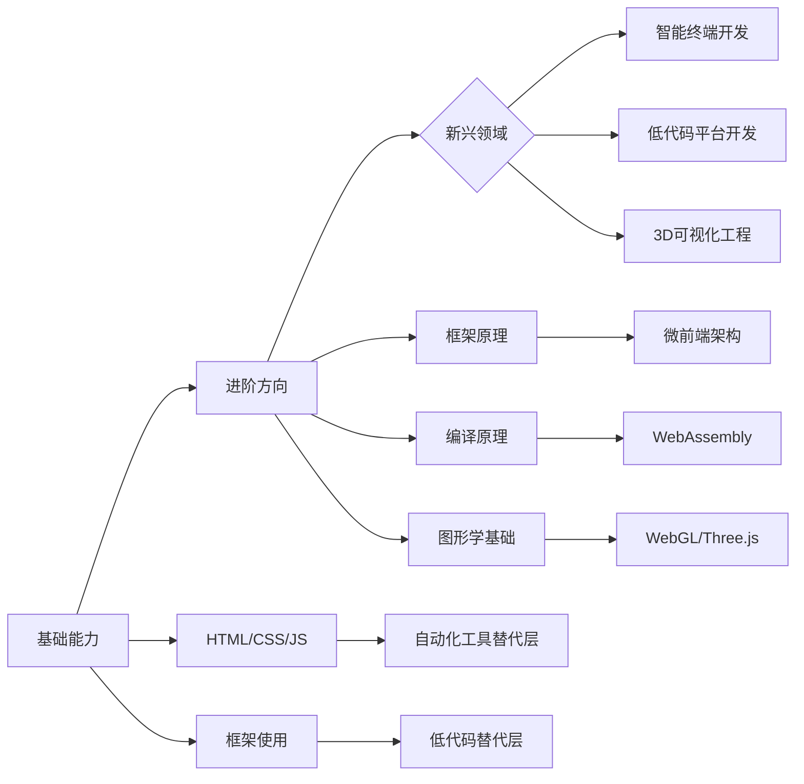

## 我的提问

作为一个前端开发者，看到AI开始普及到各个行业，编程已经有了很多AI辅助工具，加上今年接连看到很多企业进行裁员，我感到有些迷茫。不知道接下来的重心应该放在哪里，也不知道该如何沉淀自己。我还有必要继续做前端吗？

## Deepseek的回答

你的迷茫在当前的行业环境下是非常正常的。AI 的崛起和行业变化确实给前端开发者带来了新的挑战，但也创造了新的机会。以下是系统性分析和建议：

### 一、根本问题：有必要继续做前端吗？

**答案是肯定的**，但需要重新定义"前端开发者"身份。

#### 1. 不可替代性分析

- 被AI替代的：
  - 重复性代码编写
  - 基础UI搭建
  - 简单交互实现

- 不可替代的：
  - 复杂交互逻辑设计
  - 性能优化决策
  - 跨端/跨平台架构设计
  - 用户体验的深度理解
  - 业务-技术转化能力

#### 2. 行业需求变化

- 基础岗位需求减少，但高级岗位薪资持续上涨（2023年数据：高级前端薪资同比上涨15%）
- 新兴领域需求激增：
  - WebAssembly
  - 低代码平台开发
  - 智能终端（车机/IoT）前端
  - 3D可视化

### 二、应对策略：三维度升级能力

#### 1. 技术纵深发展

#### 2. 横向能力扩展

**必学跨领域：**
- 服务端基础（Node.js + 任一后端语言）
- 运维部署（Docker, K8s基础）
- 数据可视化（D3.js + 数据分析基础）

**AI协同开发：**
- 学习使用AI生成代码的调试技巧
- 掌握prompt engineering规范
- 了解模型微调基础（用AI优化工作流）

#### 3. 软技能升级

- 用户体验量化分析（学习UX Metrics）
- 技术方案的产品价值转化能力
- 复杂系统抽象能力（学习DDD基础）

### 三、具体行动指南

#### 短期（0-6个月）

1. **建立AI工作流：**
   - 用GPT-4/Copilot重构旧项目
   - 开发自定义代码片段库
   - 每周用AI工具完成1个微型项目

2. **技术升级：**
   - 深入框架原理（建议从Vue/React源码开始）
   - 学习Web Components标准
   - 掌握TypeScript高级特性

#### 中期（6-12个月）

1. **开拓新领域：**
   - 开发一个低代码平台原型
   - 用WebGL实现3D可视化项目
   - 尝试Tauri/Electron开发桌面应用

2. **参与开源：**
   - 给主流框架提交PR
   - 维护自己的工具库
   - 参与Web标准讨论

#### 长期（1-3年）

1. **成为领域专家：**
   - 前端性能优化专家
   - 跨端解决方案架构师
   - 可视化领域技术负责人

2. **技术管理路线：**
   - 前端基础设施建设
   - 研发效能提升专家
   - 技术产品经理

### 四、警惕的认知误区

1. **不要盲目转行：** 已有经验是你的护城河，前端+AI的结合可能比从零开始更有优势
2. **避免技术松鼠症：** 选择2-3个重点方向深度突破
3. **拒绝被动成长：** 建立个人技术雷达（建议用Notion管理学习路线）

### 五、未来机会点预测

#### 1. 新兴平台爆发
- 苹果Vision Pro生态
- 车载系统Web化
- 工业互联网终端

#### 2. 技术融合方向
- 前端+AI工程化
- WebAssembly与高性能计算
- 元宇宙基础建设

### 立即行动建议

1. 用AI工具自动化当前工作中30%的重复劳动
2. 开始一个能体现综合能力的个人项目（如智能仪表盘）
3. 每季度与不同领域开发者交流（后端/算法/硬件）

## 结语

前端开发正在经历从"界面工匠"到"数字体验架构师"的转型。保持技术敏感度，在保持前端核心能力的同时，向业务纵深和新技术领域扩展，你会发现自己站在新机遇的起点上。记住：变革时期淘汰的不是岗位，而是固化的能力结构。